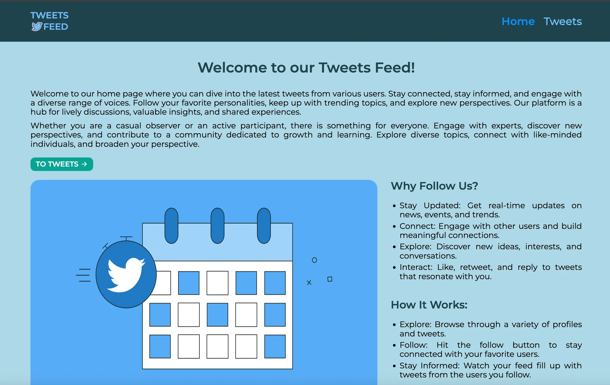
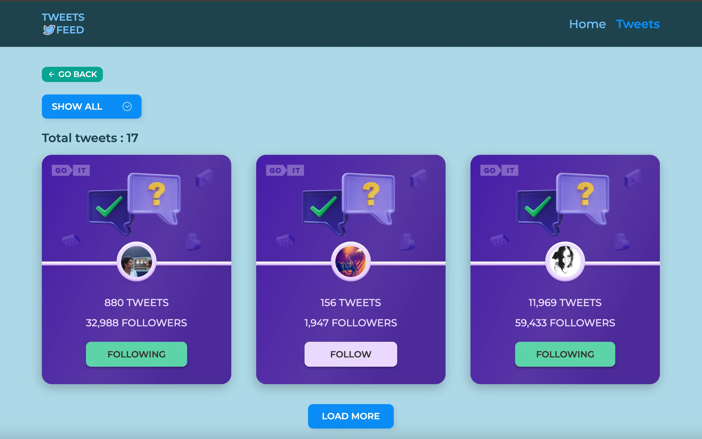

# Tweets-Feed

[Tweets-Feed](https://tweets-brown.vercel.app/) - application designed for viewing and interacting
with the latest tweets from various users. Its main purpose is to provide the ability to subscribe
and follow current topics, opinions, and discussions of other users.

## Features

The main features and capabilities of the application include:

- Subscribing to interesting users: Users can subscribe to users they find interesting to receive
  their updates and keep track of their activity.
- Button "Load More": Upon pressing the button, three tweet cards are loaded.
- Filter: Filtering tweet cards by categories: 'Show all', 'Follow', 'Followings'.
- Total tweets: Below the filter, the number of found cards according to the criteria is displayed.
- Responsive layout: Responsive design catering to all device types. For mobile devices, a burger
  menu has been implemented.
- Scroll-up button: Provides users with a convenient way to quickly navigate to the top of the page.
  This enhances the user experience and makes navigation more efficient by allowing users to easily
  return to the beginning of the page without having to scroll manually.

## Technologies Used:

- React.js
- Redux Toolkit
- HTML & CSS
- JavaScript
- Axios
- React Router
